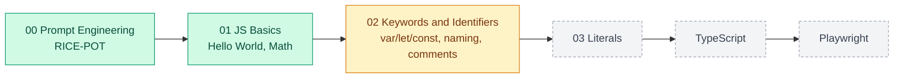
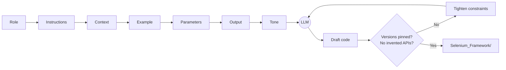
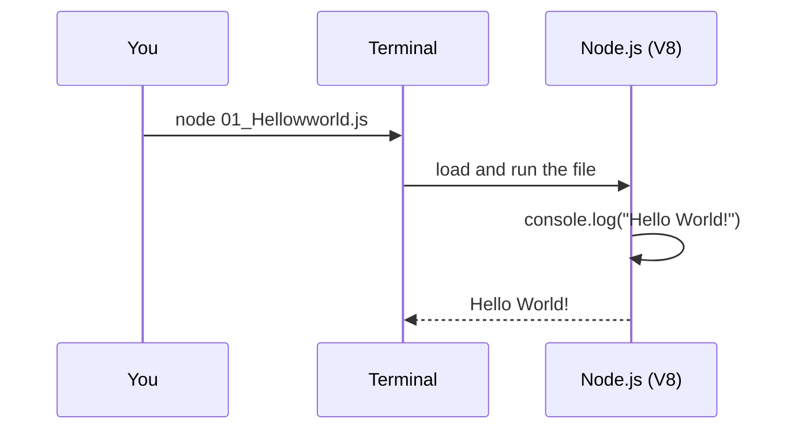
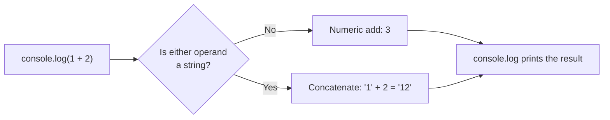
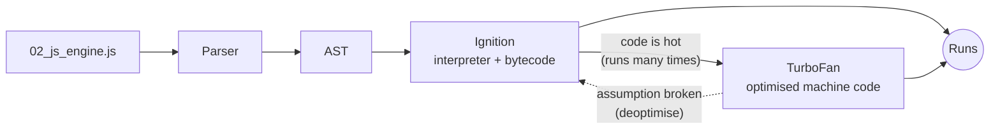
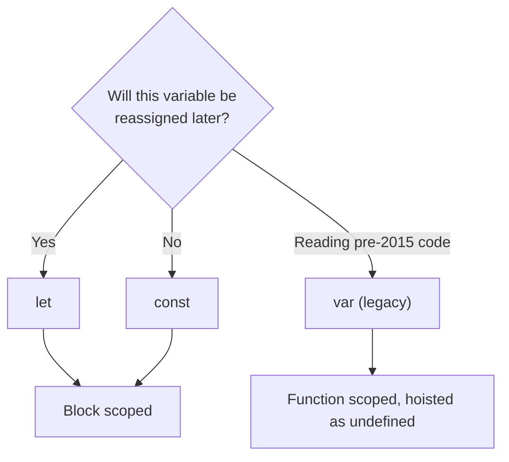
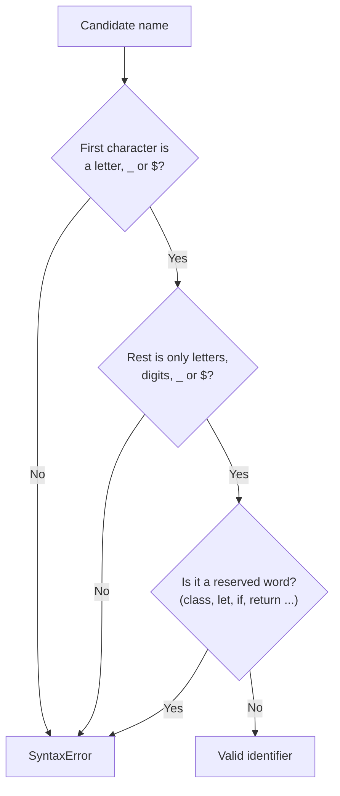
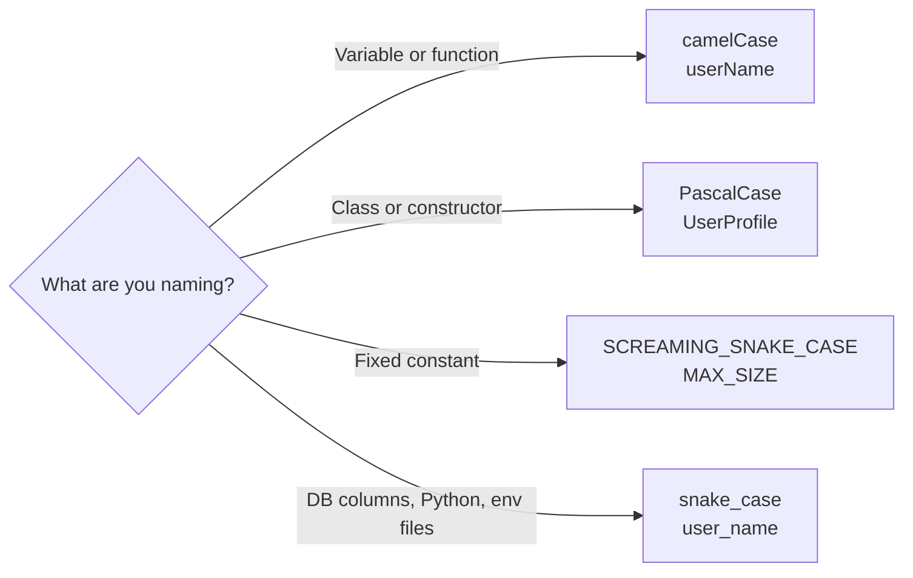
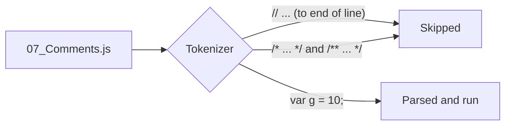
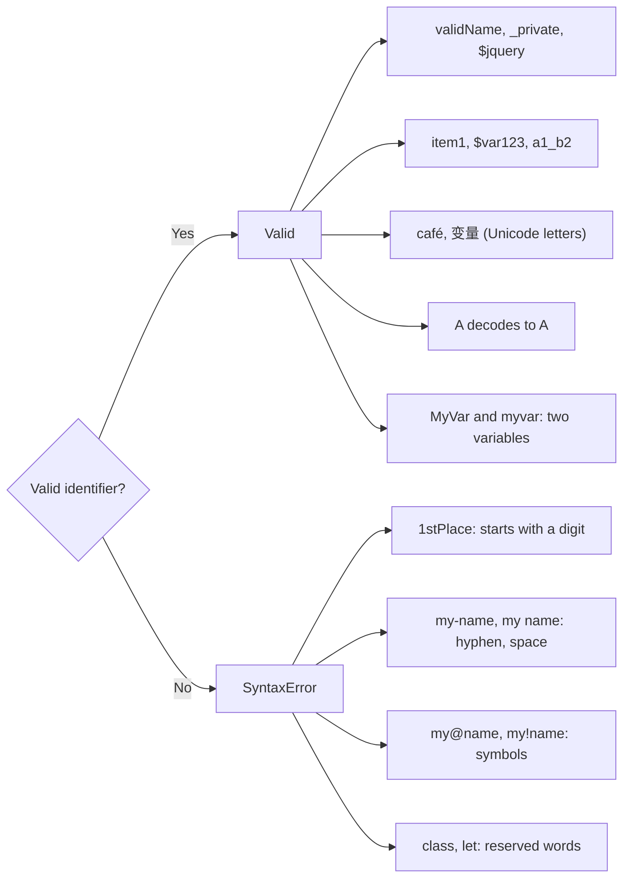

# Learn JavaScript, TypeScript & Playwright (4x)


A chapter-by-chapter learning repo for testers moving into JavaScript, TypeScript, and Playwright automation. Every chapter is a folder, every lesson is a small file you can run on its own.

---

## Table of Contents

- [Roadmap](#roadmap)
- [Chapter Summary](#chapter-summary)
- [Project Structure](#project-structure)
- [Getting Started](#getting-started)
- [Chapter 00: Prompt Engineering](#chapter-00-prompt-engineering)
  - [00: RICE-POT Prompt Engineering](#00-rice-pot-prompt-engineering)
- [Chapter 01: JavaScript Basics](#chapter-01-javascript-basics)
  - [01: Hello World](#01-hello-world)
  - [02: Math with Numbers](#02-math-with-numbers)
  - [03: DOM Basics](#03-dom-basics)
- [Chapter 02: Keywords and Identifiers](#chapter-02-keywords-and-identifiers)
  - [03: The JavaScript Engine](#03-the-javascript-engine)
  - [05: Keywords vs Identifiers: var, let, const](#05-keywords-vs-identifiers-var-let-const)
  - [06: Identifier Rules](#06-identifier-rules)
  - [07: Naming Conventions](#07-naming-conventions)
  - [08: Comments](#08-comments)
  - [09: Interview Questions on Identifiers](#09-interview-questions-on-identifiers)
- [Coming Up](#coming-up)

---

## Roadmap



---

## Chapter Summary

| # | Chapter | Folder | Status | What you learn |
|:--|:--------|:-------|:------:|:---------------|
| 00 | Prompt Engineering | [00_Chapter_Prompt_engineering](00_Chapter_Prompt_engineering/) | ✅ Done | RICE-POT prompts, anti-hallucination rules, the Selenium framework a prompt generated |
| 01 | JavaScript Basics | [01_Chapter_JS_Basics](01_Chapter_JS_Basics/) | ✅ Done | Running a file with Node, `console.log`, arithmetic, DOM basics |
| 02 | Keywords and Identifiers | [02_Chapter_JS_Keywords_Identifiers](02_Chapter_JS_Keywords_Identifiers/) | 🟡 In progress | How V8 runs code, `var`/`let`/`const`, identifier rules, naming conventions, comments |
| 03 | Literals | `03_chapter_JS_Literals` | ⏳ Planned | Number, string, boolean, array and object literals |

---

## Project Structure

```text
Learn_JSTS_Playwright_4X/
├── README.md
├── 00_Chapter_Prompt_engineering/
│   ├── 00_RICE_POT_FullForm.md             # What each RICE-POT letter means
│   ├── 01_RICE_POT_Prompt.md               # Worked prompt: Salesforce login (Selenium + TestNG)
│   ├── 02_Problem_Statement.md             # The objective the prompt solves
│   ├── 03_Anti_Hallucinations.md           # Version anchors, negative constraints, self-checks
│   ├── 04_RICE_POT_Generic_QA_Template.md  # Reusable template: test plans, cases, automation
│   └── Selenium_Framework/                 # The framework the prompt produced (Java 17, TestNG)
├── 01_Chapter_JS_Basics/
│   ├── 01_Hellowworld.js                   # First program: console.log
│   ├── 02_Math.js                          # Arithmetic expressions
│   └── 03_DOM_Basics.md                    # DOM concepts and Playwright connection
├── 02_Chapter_JS_Keywords_Identifiers/
│   ├── 01_Keywords_and_Identifiers.md      # Keywords, identifiers and naming rules
│   ├── 02_js_engine.js                     # How V8 runs a file, hot code and JIT
│   ├── 03_letengine.js                     # Smallest program: one let declaration
│   ├── 04_KW_IND.js                        # Keyword vs identifier: var, let, const
│   ├── 05_KW_IND_Rules.js                  # Identifier rules: what a name may contain
│   ├── 06_IND_Rules2.js                    # Naming conventions
│   ├── 07_Comments.js                      # Single-line, multi-line and JSDoc comments
│   └── 08_IQ.js                            # Interview drill: valid vs invalid identifiers
└── 03_Chapter_JS_Literals/                 # (planned)
```

---

## Getting Started

You only need [Node.js](https://nodejs.org/) 18 or newer. No `npm install` yet.

```bash
git clone https://github.com/vmmukundhanleo/Learn_JSTS_Playwright_4X.git
cd Learn_JSTS_Playwright_4X
node --version                              # v18+ (tested on v22)
node 01_Chapter_JS_Basics/01_Hellowworld.js  # Hello, World!
```

Every lesson file runs the same way: `node <chapter folder>/<file>.js`.

---

## Chapter 00: Prompt Engineering

### 00: RICE-POT Prompt Engineering

**Concept:** RICE-POT is a seven-part prompt template (**R**ole, **I**nstructions, **C**ontext, **E**xample, **P**arameters, **O**utput, **T**one) for getting production-quality test artifacts out of an LLM instead of toy snippets.

**Why:** A one-line prompt like "write Selenium code" gets you outdated APIs and invented methods; RICE-POT plus explicit anti-hallucination rules pins the model to real versions, real patterns, and a fixed output shape.

**Q&A: why use this?**
- **Q: When do I reach for it?** A: Any time you ask an AI for a framework, test plan, or test cases. The [generic QA template](00_Chapter_Prompt_engineering/04_RICE_POT_Generic_QA_Template.md) covers all four task types.
- **Q: What does it replace?** A: Ad-hoc, one-line prompts that leave the model to guess your stack, your versions, and what "done" looks like.
- **Q: What's the gotcha?** A: A well-structured prompt can still produce invented APIs. Pin library versions and add "do NOT" rules ([03_Anti_Hallucinations.md](00_Chapter_Prompt_engineering/03_Anti_Hallucinations.md)), then review the code before trusting it.



The anti-hallucination block from [03_Anti_Hallucinations.md](00_Chapter_Prompt_engineering/03_Anti_Hallucinations.md), ready to paste under any RICE-POT prompt:

```markdown
Role: Senior SDET Automation Architect.
Task: Generate a test automation script for [Application/Workflow].

Constraints & Anti-Hallucination Rules:
1. Version Anchors: Java 17+, Selenium 4.x, TestNG 7.x.
2. Deprecation Checks:
   - Use `java.time.Duration` for timeouts.
   - Use `ChromeOptions` / `FirefoxOptions` (no `DesiredCapabilities`).
   - Use `WebDriverWait(driver, Duration.ofSeconds(x))` (no two-argument timeout with integer and TimeUnit).
3. Grounding: Rely strictly on standard Selenium 4 API calls. Do not invent custom methods on WebDriver or WebElement.
4. Completeness: Ensure all import statements are fully qualified and valid.
```

The full result of this prompt lives in [Selenium_Framework/](00_Chapter_Prompt_engineering/Selenium_Framework/README.md).

---

## Chapter 01: JavaScript Basics

### 01: Hello World

**Concept:** `console.log()` prints a value to the output. Run a `.js` file with `node <file>` and whatever you log appears in your terminal.

**Why:** Before variables, functions, or Playwright, you need one reliable way to see what your code is doing, and `console.log` is that tool.

**Q&A: why use this?**
- **Q: When do I reach for it?** A: Whenever you want to see a value while learning or debugging. In Playwright tests it is the first debugging tool you will use, long before the trace viewer.
- **Q: What does it replace?** A: Java's `System.out.println` or Python's `print`. Same idea, but JavaScript needs no class and no `main` method: one line is a whole program.
- **Q: What's the gotcha?** A: Where the output lands depends on where the code runs. With `node` it prints to your terminal; inside the browser (for example in Playwright's `page.evaluate`) it prints to the browser's DevTools console instead.



```js
// 01_Chapter_JS_Basics/01_Hellowworld.js
console.log("Hello, World!");
```

```bash
$ node 01_Chapter_JS_Basics/01_Hellowworld.js
Hello, World!
```

### 02: Math with Numbers

**Concept:** JavaScript evaluates an expression like `1+2` first and then hands the result to `console.log`, so you see `3`, not the text `1+2`.

**Why:** Tests constantly compute expected values (cart totals, row counts, page numbers), so you need to know how JavaScript does arithmetic before you assert on it.

**Q&A: why use this?**
- **Q: When do I reach for it?** A: Calculating an expected value inside a test, for example `expect(total).toBe(price * qty)` instead of hard-coding the answer.
- **Q: What does it replace?** A: Working numbers out by hand or in a calculator and pasting them into test data, which breaks as soon as the inputs change.
- **Q: What's the gotcha?** A: `+` is overloaded. If either side is a string it concatenates: `"1" + 2` gives `"12"`. Also, every JavaScript number is a 64-bit float, so `0.1 + 0.2` prints `0.30000000000000004`.



```js
// 01_Chapter_JS_Basics/02_Math.js
console.log(3+3);
console.log(3-3);
console.log(3*3);
console.log(3/3);
console.log(3%3);
console.log(3**3);
```

```bash
$ node 01_Chapter_JS_Basics/02_Math.js
6
0
9
1
0
27
```

| Operator | Meaning | Example | Result |
|:--------:|:--------|:--------|:------:|
| `+` | Add (or concatenate strings) | `1 + 2` | `3` |
| `-` | Subtract | `5 - 2` | `3` |
| `*` | Multiply | `2 * 2` | `4` |
| `/` | Divide (always a float) | `7 / 2` | `3.5` |
| `%` | Remainder | `7 % 2` | `1` |
| `**` | Power | `2 ** 3` | `8` |

### 03: DOM Basics

**Concept:** The Document Object Model (DOM) is the browser's live, in-memory tree representation of an HTML page. JavaScript can find elements, read or change their content, and respond to events.

**Why:** Playwright locators find elements in the DOM, so understanding the DOM helps explain how browser automation interacts with a page.

Read the [DOM basics notes](01_Chapter_JS_Basics/03_DOM_Basics.md) for the tree model, common DOM operations, event propagation, and the connection to Playwright.

---

## Chapter 02: Keywords and Identifiers

### 03: The JavaScript Engine

**Concept:** `node` hands your file to V8, Google's JavaScript engine. V8 parses the whole file, turns it into bytecode, runs that in an interpreter (Ignition), and recompiles "hot" code, code that runs many times like a loop body, into fast machine code (TurboFan). This is Just-In-Time (JIT) compilation.

**Why:** Knowing that JavaScript is compiled just in time, not read line by line, explains why a single syntax error stops the whole file and why loops get faster the longer they run.

**Q&A: why use this?**
- **Q: When do I reach for it?** A: When a file fails with `SyntaxError` and nothing prints, not even the `console.log` on line 1. V8 parses the entire file before it runs any of it.
- **Q: What does it replace?** A: The idea that JavaScript is "just interpreted". V8 interprets first, then optimises the hot paths, and drops back to the interpreter (deoptimises) if its assumptions about your values break.
- **Q: What's the gotcha?** A: The hot-code loop in `02_js_engine.js` is commented out for a reason: 100,000 iterations, each calling `console.log` twice, floods the terminal. It also calls `badCodeFn()` before the function is written, which works because function declarations are hoisted.



```js
// 02_Chapter_JS_Keywords_Identifiers/02_js_engine.js
let a = 10;
console.log(a);

// Hot Code
//  for (let a = 0; a < 100000; a++) {
//     console.log(a);
//     badCodeFn();
// }

// function badCodeFn() {
//     console.log("Hello");
// }
```

```bash
$ node 02_Chapter_JS_Keywords_Identifiers/02_js_engine.js
10
```

`03_letengine.js` is the smallest program you can feed the engine: a single `let x = 10;`. It prints nothing, but V8 still parses, compiles and runs it.

### 05: Keywords vs Identifiers: var, let, const

**Concept:** A keyword is a word the language owns (`var`, `let`, `const`, `if`, `class`, `return`). An identifier is the name you choose. In `let l = 10;`, `let` is the keyword, `l` is the identifier and `10` is the literal value.

**Why:** Every variable in a test (a URL, a timeout, an expected value) starts with one of these three keywords, so choosing between them is the first decision you make on every line.

**Q&A: why use this?**
- **Q: When do I reach for it?** A: `let` for values that change, `const` for values that are never reassigned (URLs, timeouts, config), `var` only when reading older code. The lesson's rule of thumb for QA scripts: `let` about 96%, `const` about 3%, `var` about 1%.
- **Q: What does it replace?** A: `var` was the only option before ES6 (2015). `var` is function-scoped and can be declared twice; `let` and `const` are block-scoped and a second declaration in the same scope is a `SyntaxError`.
- **Q: What's the gotcha?** A: `const` blocks reassignment, not change: `const arr = []; arr.push(1)` is fine. Reassigning a `const` throws `TypeError: Assignment to constant variable.`



| | `var` | `let` | `const` |
|:--|:--:|:--:|:--:|
| Scope | Function | Block | Block |
| Declare twice in the same scope | ✅ Allowed | ❌ `SyntaxError` | ❌ `SyntaxError` |
| Reassign | ✅ | ✅ | ❌ `TypeError` |
| Use before the declaration line | `undefined` | ❌ `ReferenceError` | ❌ `ReferenceError` |

```js
// 02_Chapter_JS_Keywords_Identifiers/04_KW_IND.js
var v = 10;   // keyword: var,   identifier: v
let l = 10;   // keyword: let,   identifier: l
const c = 10; // keyword: const, identifier: c

// What happens when you break the rules:
// let l = 20;      SyntaxError: Identifier 'l' has already been declared
// c = 20;          TypeError: Assignment to constant variable.
```

### 06: Identifier Rules

**Concept:** An identifier must start with a letter, `_` or `$`. After the first character it may also contain digits. No spaces, no hyphens, no reserved words, and names are case sensitive.

**Why:** Breaking a rule is a `SyntaxError`, and because V8 parses the whole file first, one bad name stops the entire file from running.

**Q&A: why use this?**
- **Q: When do I reach for it?** A: Every time you name something. Check three things: the first character is a letter, `_` or `$`; the rest are letters, digits, `_` or `$`; the name is not a reserved word.
- **Q: What does it replace?** A: Nothing new if you know Java: the rules are nearly identical. Even `$` and `_` on their own are legal names (`var $ = 10; var _ = 10;`).
- **Q: What's the gotcha?** A: Names are case sensitive, so `Name` and `name` are two different variables. And the error rarely says "bad name": `var 45 = 34` throws `SyntaxError: Unexpected number`.



```js
// 02_Chapter_JS_Keywords_Identifiers/05_KW_IND_Rules.js (excerpt)
var a = 10;
var $ = 10;               // $ alone is a valid name
var _a = 23;
var _ = 10;               // _ alone is a valid name
var ab123 = 23;           // digits are fine after the first character

var Name = "pramod";      // Name and name are two
var name = "Amit";        // different variables

var pramod_dutta = "hello";
var pramod$dutta = "hello";

// var 45 = 34;              SyntaxError: Unexpected number
// var pramod dutta = "x";   SyntaxError: Unexpected identifier 'dutta'
```

### 07: Naming Conventions

**Concept:** Conventions are team agreements on how to write a name: camelCase for variables and functions, PascalCase for classes and constructors, SCREAMING_SNAKE_CASE for constants, snake_case mostly outside JavaScript.

**Why:** The engine accepts all of them; people reading your test need the casing to tell a class from a variable from a fixed config value at a glance.

**Q&A: why use this?**
- **Q: When do I reach for it?** A: camelCase for almost everything (`userName`, `isLoggedIn`), PascalCase for Page Object classes (`LoginPage`), SCREAMING_SNAKE_CASE for values that never change (`BASE_URL`, `MAX_RETRIES`).
- **Q: What does it replace?** A: Hungarian notation (`strName`, `bActive`, `nCount`), an older style that put the type in the name. TypeScript types do that job now, so modern style guides avoid it.
- **Q: What's the gotcha?** A: Conventions are not enforced. `This_is_a_very_long_name_variable` runs fine; only a linter (ESLint's `camelcase` rule) or a code review will catch it.



| Convention | Example | Used for in JS |
|:-----------|:--------|:---------------|
| camelCase | `totalPrice` | Variables, functions (the default) |
| PascalCase | `ShoppingCart` | Classes, constructors, Page Objects |
| SCREAMING_SNAKE_CASE | `API_KEY` | Constants and config |
| snake_case | `total_price` | Rare in JS; common in Python and SQL |
| Hungarian | `bActive` | Legacy code only |

```js
// 02_Chapter_JS_Keywords_Identifiers/06_IND_Rules2.js (excerpt)
let userName = "camelCase";          // 1. camelCase
let isLoggedIn = true;

let UserProfile = "PascalCase";      // 2. PascalCase

let user_name = "snake_case";        // 3. snake_case

const MAX_SIZE = 100;                // 4. SCREAMING_SNAKE_CASE
const API_KEY = "abc123";
// MAX_SIZE = 90;                    TypeError: Assignment to constant variable.

let strName = "string prefix";       // 5. Hungarian notation (older style)
let bActive = true;
```

### 08: Comments

**Concept:** Comments are text the engine skips. `//` comments out the rest of the line, `/* ... */` spans multiple lines, and `/** ... */` is a JSDoc block that editors like VS Code show as hover documentation.

**Why:** Comments explain why code exists, and commenting out a line is the fastest way to switch it off while debugging a test.

**Q&A: why use this?**
- **Q: When do I reach for it?** A: To explain intent, to switch a line off temporarily (`Cmd + /` on Mac, `Ctrl + /` on Windows and Linux in VS Code), and to add JSDoc to functions other people will call.
- **Q: What does it replace?** A: Nothing new if you know Java: the same `//`, `/* */` and `/** */` syntax. Javadoc becomes JSDoc.
- **Q: What's the gotcha?** A: Block comments do not nest. In `/* outer /* inner */ still code */` the comment ends at the first `*/`, so `still code */` is parsed as code and throws a `SyntaxError`.



```js
// 02_Chapter_JS_Keywords_Identifiers/07_Comments.js
// This is a single-line comment, it will be ignored
// this line will not be executed

/*
 *  This is a multi-line comment
 *  Author : Pramod Dutta
 *  Date : 11-Jul-2026
 */

/**
 *  This is a JSDoc comment
 *  Author : Pramod Dutta
 *  Date : 14-Feb-2026
 **/

var g = 10; // cmd + /, ctrl + /
```

### 09: Interview Questions on Identifiers

**Concept:** A drill file of the identifier cases interviewers like to ask about: legal first characters, digits, Unicode names, escape sequences, case sensitivity, and the characters that break a name.

**Why:** These questions check whether you know the actual rule or only the everyday cases, and the edge cases (Unicode, escapes) are where people get caught.

**Q&A: why use this?**
- **Q: When do I reach for it?** A: Before an interview, or when a reviewer asks "is that even legal?". Run `node 02_Chapter_JS_Keywords_Identifiers/08_IQ.js`: it exits silently, which proves every uncommented line is valid.
- **Q: What does it replace?** A: Memorising a list. It is the same rule as lesson 06, applied to Unicode: `café` and `变量` are valid because `é` and `变` count as letters.
- **Q: What's the gotcha?** A: `let A = ...` declares a variable named `A`, because the escape is decoded before the name is checked. And `Function` is a built-in, not a reserved word: `let Function = "x"` runs and shadows the global. Reserved words such as `class` or `let` are the ones that fail.



```js
// 02_Chapter_JS_Keywords_Identifiers/08_IQ.js (excerpt)
let validName = "starts with letter";
let _private = "starts with underscore";
let $jquery = "starts with dollar sign";
let a1_b2 = "mixed letters digits underscore";

// let 1stPlace = "invalid";     SyntaxError: Invalid or unexpected token

// let Function = "invalid";     but it actually works: Function is a
//                               built-in name, not a reserved word
let MyVar = "uppercase M";       // case sensitive:
let myvar = "lowercase v";       // two separate variables

let café = "Unicode letter é";
let 变量 = "Chinese characters";
let A = "Unicode escape for A";  // this variable is named A

// let my-name = "invalid";      SyntaxError: Unexpected token '-'
// let my name = "invalid";      SyntaxError: Unexpected identifier
// let my@name = "invalid";      SyntaxError: Unexpected token '@'
```

---

## Coming Up

- **Chapter 03: Literals**: number, string, boolean, array, and object literals in depth.
- Then TypeScript, then Playwright.
